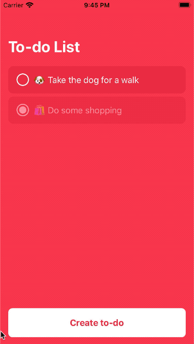

# Todoist 
A todo application built with React Native, uses Redux for state and react-navigation for navigation. 



## To Run
You will need to have you machine setup to run react native projects then follow the commands below.

Install dependencies 
```
yarn 
```

Start Android
```
yarn android
```

Start iOS
```
yarn ios
```